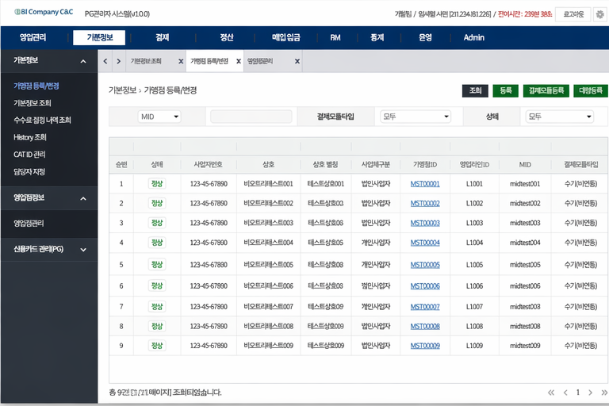
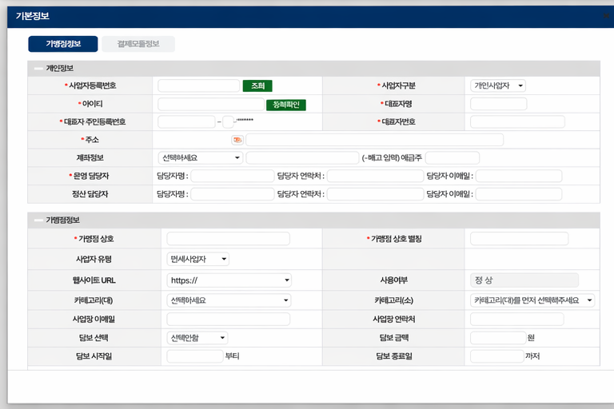
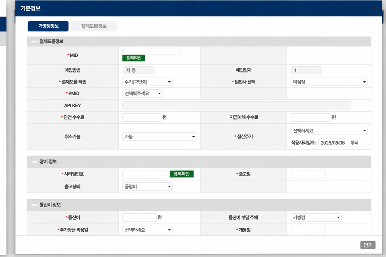
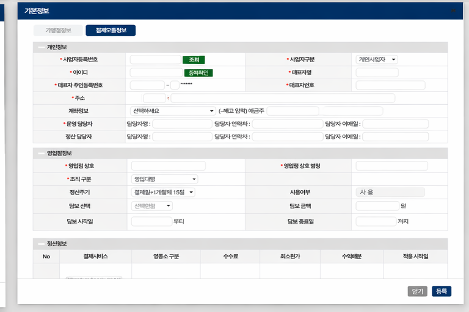
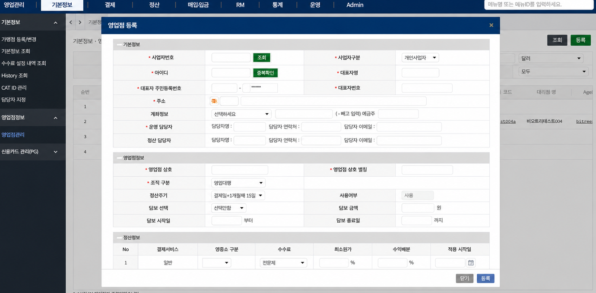
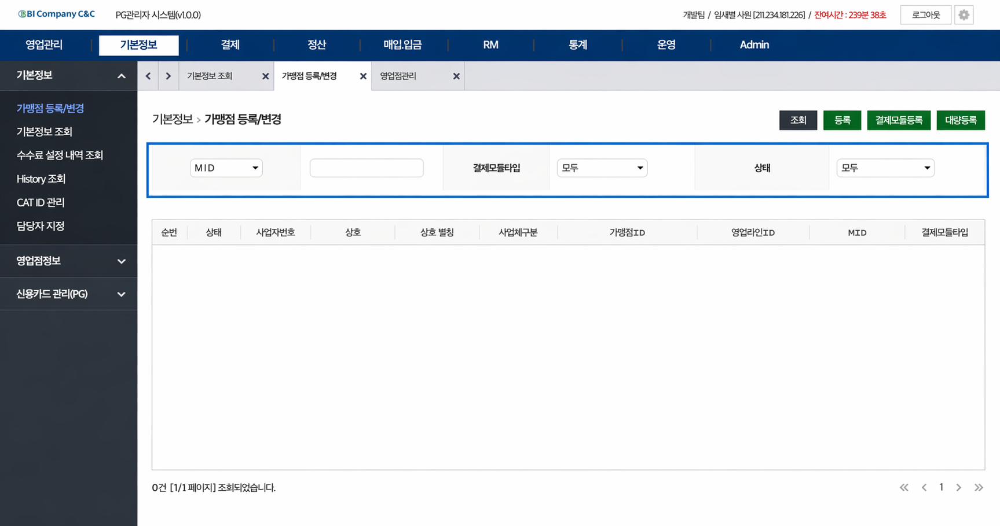
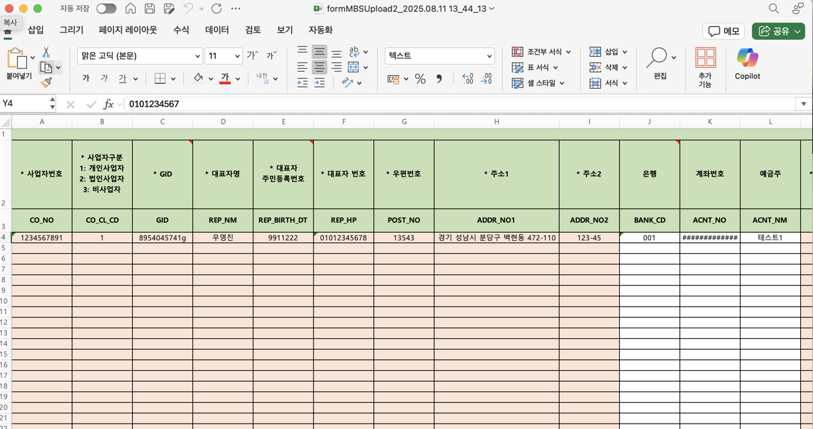
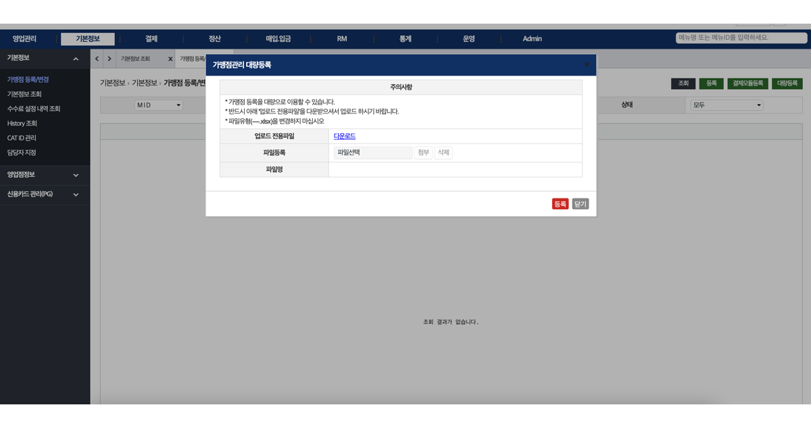

# 🧑‍💻 Admin Management System
> 가맹점 및 영업점의 기본 정보를 효율적으로 관리하고,
대량 데이터 처리까지 고려한 웹 기반 관리자 시스템 (End-to-End 개발)

⸻

📌 프로젝트 개요

* 프로젝트명: Admin Management System
* 개발 기간: 2025.03 ~ 2025.05 (약 3개월)
* 개발 인원: 1명 (단독 프로젝트)
* 역할: 기획, 화면 설계, 프론트엔드 및 백엔드 개발, DB 설계, 배포 및 운영
* 플랫폼: Web

⸻

🛠 개발 환경

* Language: Java 17, JavaScript
* Frontend: HTML5, CSS3, JavaScript 
* Framework: Spring Framework, MyBatis
* DB: MariaDB / Oracle
* Server: Linux (직접 배포 및 운영)
* WAS: Tomcat (또는 사용한 WAS로 수정)
* 형상관리: Git (GitLab / GitHub)

---

## 🚀 핵심 성과
- Excel 대량 업로드 기능 구현으로 반복 입력 업무 효율 개선
- 데이터 유효성 검증 로직을 통해 잘못된 데이터 입력 방지
- 화면 설계부터 프론트엔드, 백엔드, 배포까지 전 과정 직접 수행
- Linux 환경에서 배포 및 운영 유지보수 경험
- Git을 활용한 코드 버전 관리

---

## 📌 프로젝트 소개
가맹점과 영업점의 기본 정보를 등록, 수정, 조회할 수 있는 웹 기반 관리 시스템입니다.  

단순 기능 구현을 넘어  
👉 화면 UI 설계 → 프론트엔드 개발 → 백엔드 로직 구현 → 서버 배포 및 운영까지  
전 과정을 직접 수행하며 서비스 흐름을 전체적으로 경험했습니다.

특히 반복적인 수작업 입력의 비효율을 개선하기 위해  
Excel 대량 업로드 기능을 구현하여 데이터 처리 효율을 높였습니다.

---

## ⚙️ 주요 기능
- 영업점 정보 등록 / 수정 / 조회 기능
- 조건별 검색 기능
- Excel 업로드를 통한 대량 데이터 등록
- 데이터 유효성 검증
- 운영 환경 배포 및 유지보수

---

## 🔥 핵심 구현

### 1. 화면 설계 및 프론트엔드 개발

- 등록 / 조회 / 수정 화면 UI 직접 설계 및 구현
- 사용자 입력 흐름을 고려한 화면 구성
- JavaScript 기반 입력 검증 및 이벤트 처리

---

### 2. 데이터 처리 및 조회 로직

- MyBatis 기반 SQL 작성
- 조건별 검색 기능 구현
- 화면에서 필요한 데이터 조회 구조 설계

---

### 3. Excel 대량 업로드 처리

- Excel 데이터를 파싱하여 DB에 일괄 저장
- 필수값 누락 및 데이터 형식 검증 로직 구현
- 잘못된 데이터 입력을 사전에 방지

---

### 4. Linux 서버 배포 및 운영
- Linux 환경에서 직접 프로젝트 배포
- 로그 기반 오류 원인 분석 및 수정
- 운영 중 발생한 이슈 대응 및 유지보수 수행

---

### 5. Git 기반 코드 관리
- Git을 활용한 버전 관리
- 기능 수정 및 유지보수 과정에서 변경 이력 관리

---

## 💥 트러블 슈팅

### 문제
Excel 업로드 시 데이터 형식 오류 또는 필수값 누락으로 인해 정상 처리되지 않는 문제 발생

### 해결
업로드 단계에서 데이터 유효성 검증 로직을 추가하여  
잘못된 데이터가 DB에 저장되지 않도록 처리

### 결과
데이터 정합성을 유지하면서 안정적인 대량 데이터 처리 가능

---

## 📊 데이터 흐름 (간단 설명)
1. 사용자 화면에서 데이터 입력 또는 Excel 업로드
2. 입력 데이터 유효성 검증
3. 검증된 데이터 DB 저장
4. 조회 요청 시 조건 기반 데이터 검색 및 반환

---

## 🖥 주요 화면
- 영업점 정보 등록 화면
- 영업점 정보 조회 및 검색 화면
- Excel 업로드 화면

---

## 👨‍💻 개발 회고

이 프로젝트를 통해 단순 CRUD 구현을 넘어  
👉 **데이터 처리 + 사용자 경험 + 운영 안정성을 함께 고려하는 개발의 중요성**을 체감했습니다.  

---

### 🚀 Spring 기반 백엔드 설계 경험

이전에는 Node.js 기반 개발을 통해  
빠른 개발과 유연한 구조의 장점을 경험했지만,  

Spring Framework를 활용하면서  
👉 **계층 구조 기반 설계와 책임 분리의 중요성**을 새롭게 이해하게 되었습니다.  

- Controller / Service / Repository 구조로 역할 분리  
- MyBatis 기반 데이터 처리 로직 설계  

👉 이를 통해 **유지보수성과 확장성을 고려한 백엔드 개발 방식**에 흥미를 가지게 되었습니다.  

---

### 📊 데이터 처리 및 성능 설계 경험

가맹점 및 영업점 정보를 관리하는 과정에서  
👉 **데이터 정확성과 사용자 편의성 사이의 균형이 중요함**을 느꼈습니다.  

- 다중 조건 검색 및 페이징 처리 구현  
- 동적 쿼리를 활용한 데이터 조회 구조 설계  

👉 이를 통해  
**성능과 유지보수성을 동시에 고려하는 데이터 처리 경험**을 쌓을 수 있었습니다.  

---

### 🔒 데이터 정합성 및 검증 설계

입력 단계에서 유효성 검증 로직을 적용하여  
👉 **잘못된 데이터가 시스템에 유입되지 않도록 설계**했습니다.  

또한 Excel 대량 업로드 기능 구현 과정에서  
👉 **대규모 데이터 처리 시 성능과 안정성을 함께 고려해야 함**을 배웠습니다.  

- 데이터 검증 로직 설계  
- 예외 처리 및 오류 대응  

---

### 🎯 성장 방향

이 경험을 통해 단순 기능 구현을 넘어  
👉 **운영 환경을 고려한 구조 설계와 유지보수성 중심의 개발**을 지향하게 되었으며,  

앞으로는  
👉 **Spring Boot 및 JPA를 활용하여 확장성과 생산성을 고려한 백엔드 개발 역량을 강화할 계획입니다.**
