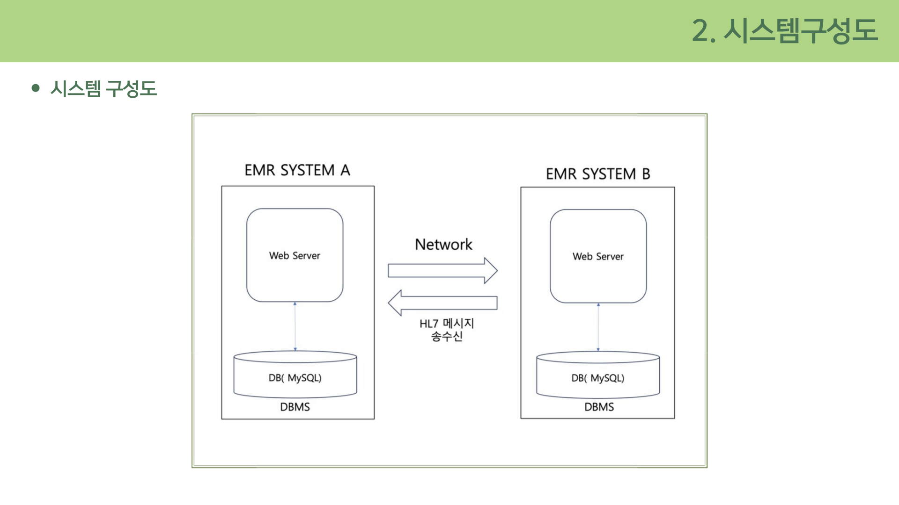
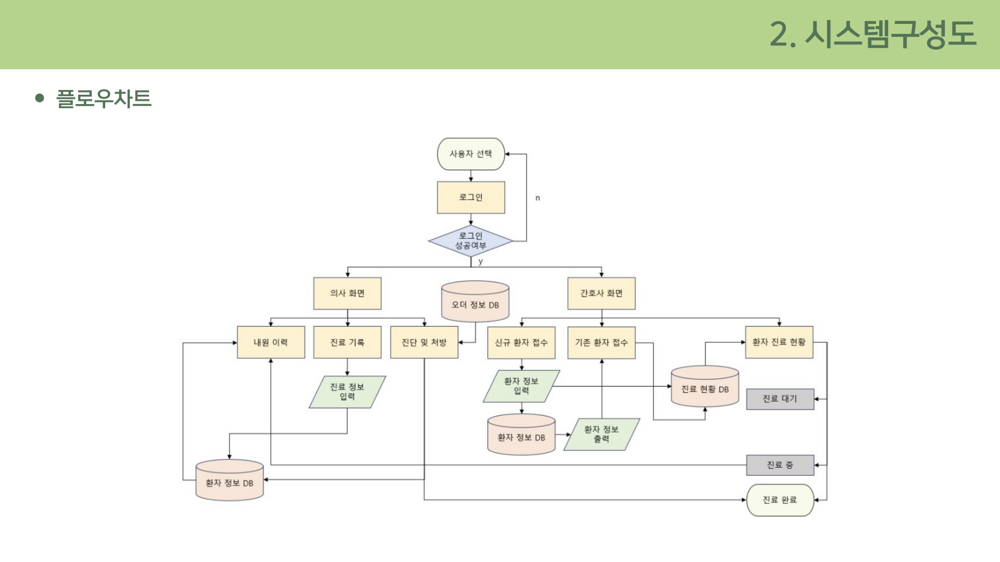
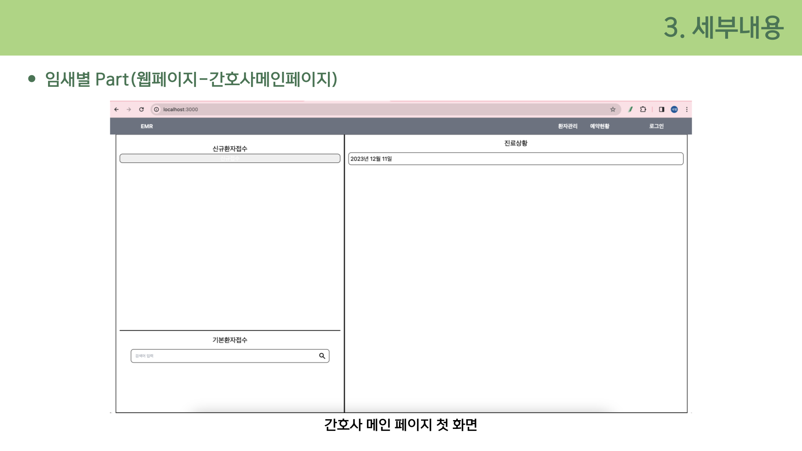
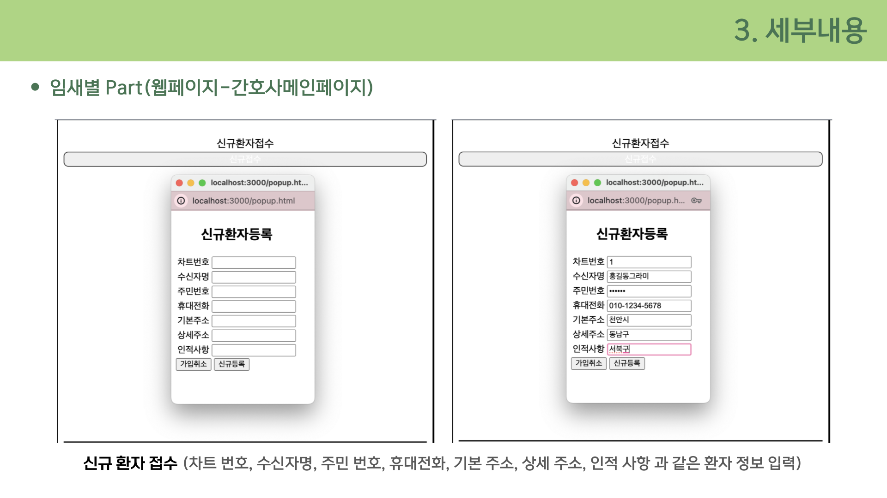
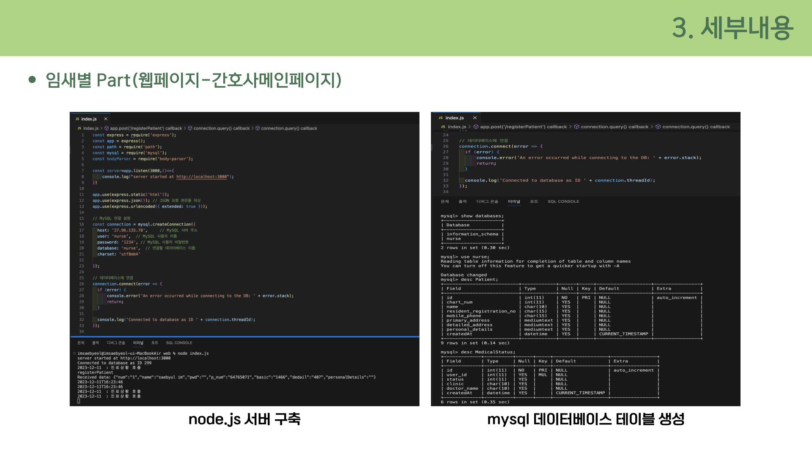
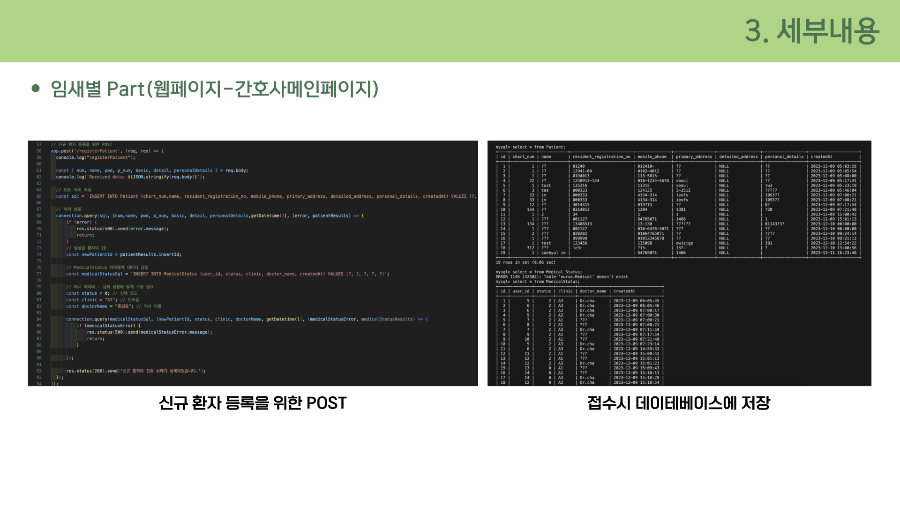

# Medical Record System

> 환자 정보 및 진료 기록을 관리하는 웹 기반 의료 데이터 시스템

---

## 프로젝트 개요

| 항목 | 내용 |
|------|------|
| 개발 기간 | 2023.09 ~ 2023.12 (약 3개월) |
| 개발 인원 | 4명 (팀 프로젝트) |
| 역할 | 간호사 페이지 UI 및 서버 개발, 데이터 처리 로직 구현 |
| 플랫폼 | Web |

---

## 기술 스택

| 구분 | 기술 |
|------|------|
| Backend | Node.js (Express) |
| Frontend | HTML, CSS, JavaScript |
| Database | MySQL |
| Tools | Git |

---

## 주요 기능

- 환자 정보 등록 / 수정 / 조회
- 진료 기록 생성 및 관리
- 환자 검색 및 데이터 조회 기능

---

## 핵심 구현

### 1. 시스템 구조 설계

<p align="center">
  
</p>
<p align="center">시스템 구조</p>

- HL7 기반 의료 데이터 송수신 구조 이해
- 시스템 간 데이터 흐름 및 역할 분리 설계

---

### 2. 데이터 흐름 설계

<p align="center">
  
</p>
<p align="center">데이터 흐름</p>

- 사용자 입력 → 서버 처리 → DB 저장 → 결과 반환 구조
- 데이터 흐름 기반 기능 설계 및 구현

---

### 3. 간호사 메인 페이지 구현

<p align="center">
  
  
</p>

- 환자 정보 등록 및 조회 UI 구현
- 진료 상태 관리 기능 개발
- 사용자 입력 기반 데이터 처리 흐름 연결

---

### 4. 서버 및 DB 처리

<p align="center">
  
  
</p>

- Node.js 기반 REST API 구현
- MySQL 데이터 저장 및 조회 처리
- 환자 정보와 진료 기록 간 관계형 데이터 처리

---

## 트러블슈팅

### 환자-진료 기록 관계 설계 문제

**문제**
환자 정보와 진료 기록 간 관계 설정이 명확하지 않아 데이터 조회 및 관리 시 비효율 발생

**해결**
환자 테이블과 진료 기록 테이블 간 관계를 재설계하고 참조 구조를 명확히 정의하여 데이터 연결

**결과**
데이터 조회 성능 및 관리 효율 개선, 데이터 정합성을 유지하는 구조 확보

---

## 데이터 흐름

```
환자 정보 입력
      ↓
서버에서 데이터 검증 및 처리
      ↓
DB에 환자 정보 및 진료 기록 저장
      ↓
조회 요청 시 조건 기반 데이터 반환
```
