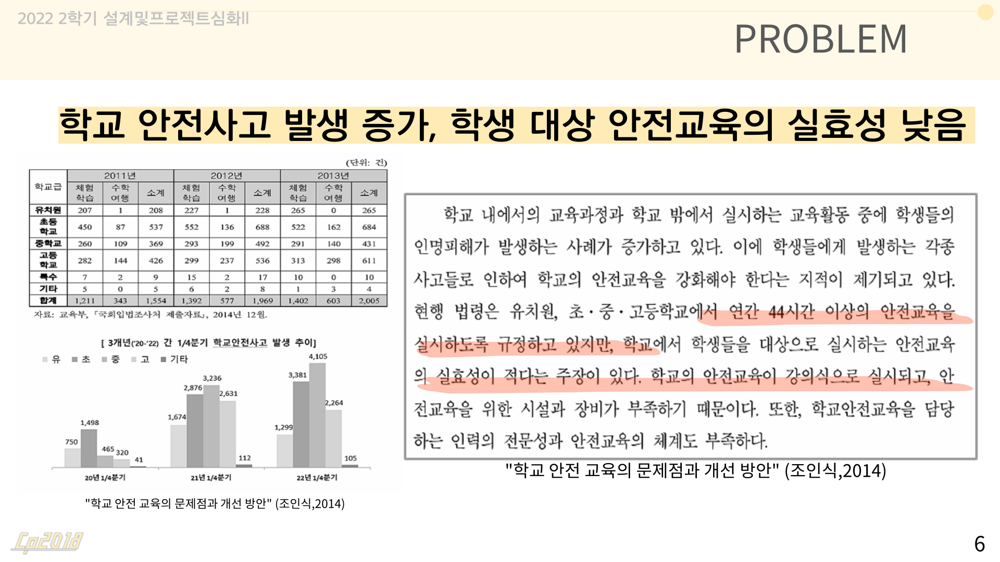
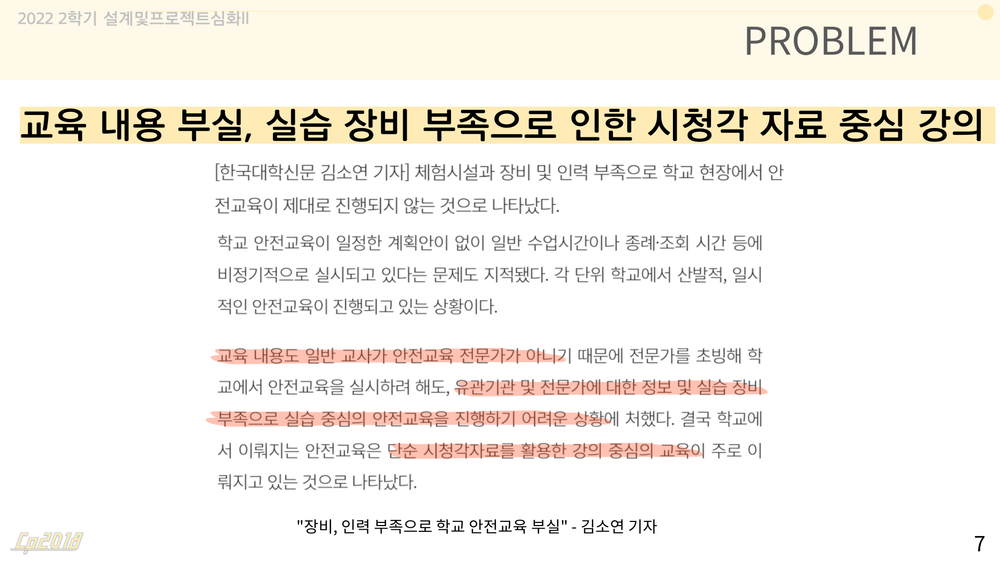
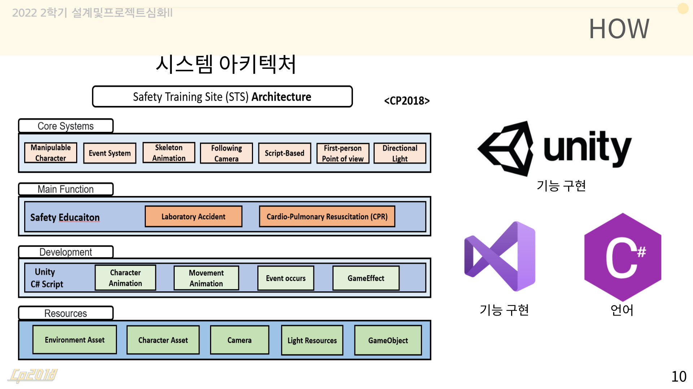
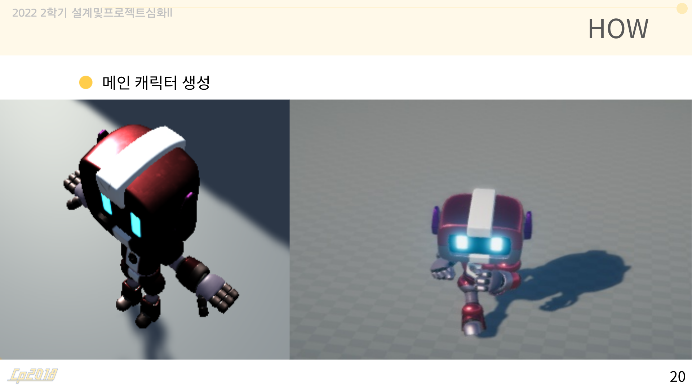
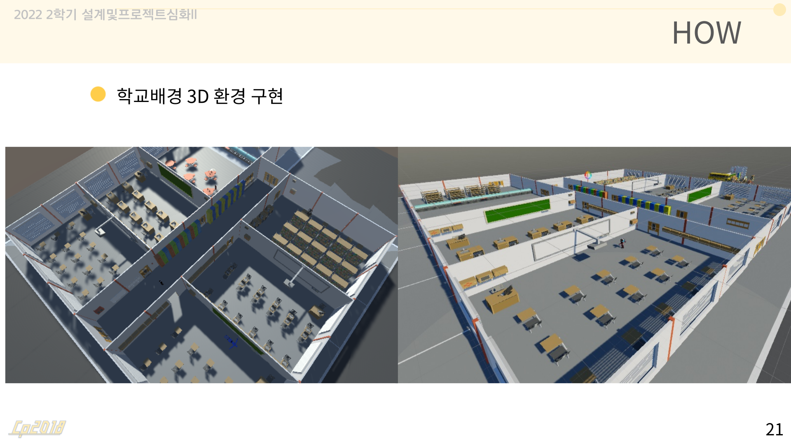
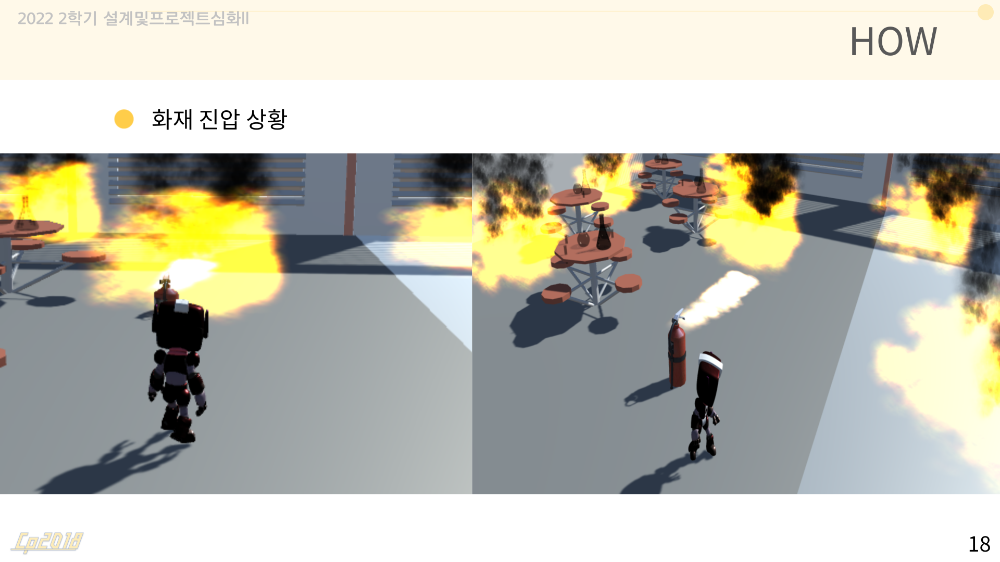

# 🦺 Safety Training Platform (STS)
> Unity 기반 메타버스 안전 교육 플랫폼

---

## 📌 프로젝트 요약

### 📌 프로젝트 개요
* 프로젝트명: Safety Training Platform (STS)
* 개발 기간: 2023.09 ~ 2023.11 (약 3개월)
* 개발 인원: 5명 (팀 프로젝트)
* 역할: Raycast 기반 상호작용 및 UI 기능 구현, 이벤트 로직 설계 참여
* 플랫폼: Unity 기반 메타버스

---

### 🛠 개발 환경
* Engine: Unity  
* Language: C#  
* Tools: Visual Studio  

---

### 🚀 핵심 성과
- 3D 메타버스 환경에서 체험형 안전 교육 시스템 구현  
- Raycast 기반 객체 상호작용 기능 개발  
- 사용자 행동 기반 인터랙션 설계 경험  
- 팀 프로젝트 협업 및 역할 분담 경험  

---

## 📌 프로젝트 소개
기존 안전 교육은 이론 중심으로 진행되어  
실제 상황 대응 능력을 키우기 어렵다는 한계를 가지고 있습니다.  

이를 해결하기 위해  
👉 **사용자가 직접 참여하며 학습할 수 있는 메타버스 기반 안전 교육 플랫폼을 구현**했습니다.  

---

## 🎯 문제 정의

  
  

- 이론 중심 교육으로 실전 대응 능력 부족  
- 실습 환경 부족으로 체험형 학습 어려움  

---

## ⚙️ 주요 기능
- CPR 및 화재 상황 시나리오 구현  
- 사용자 이동 및 상호작용 기능  
- 이벤트 기반 학습 진행 구조

---

## 🔥 핵심 구현

### 1. 시스템 구조 설계

  

- Unity 기반 기능 구조 설계  
- 사용자 행동 중심 이벤트 흐름 구성  

---

### 2. 사용자 인터랙션 환경 구현

  
  

- 사용자 캐릭터 및 3D 환경 구성  
- Unity 공간 내 이동 및 상호작용 구현  
- 텍스트 안내 UI 기반 사용자 행동 유도  
- 단계별 학습 흐름 제어 구조 설계  
- 캐릭터 애니메이션 적용  
- 몰입도 높은 교육 환경 구성  

---

### 3. Raycast 기반 상호작용 구현

  

화재 진압 인터랙션

- Raycast를 활용하여 사용자 시점에서 오브젝트 감지  
- 소화기 오브젝트에 Raycast 적용 및 거리 기반 충돌 판정  
- 불꽃 오브젝트와 충돌 시 Particle System을 탐색하여  
  자동으로 정지되도록 처리  
- 사용자 행동 → 시스템 반응 구조 설계  
- 실제 화재 진압과 유사한 인터랙션 경험 제공
  
---

## 💥 트러블 슈팅

### 문제  
이벤트가 동시에 발생하면서  
학습 흐름이 꼬이고 기능 충돌 발생  

### 해결  
- 이벤트 로직을 단계별로 분리  
- 상태값 기반으로 이벤트 흐름 제어  

### 결과  
안정적인 인터랙션 구조 확보  
사용자 경험 개선  

---

## 📊 데이터 흐름
1. 사용자 행동 입력  
2. Raycast 기반 오브젝트 감지  
3. 조건에 따른 이벤트 실행  
4. UI 안내 및 피드백 제공  

---

## 👨‍💻 개발 회고
이 프로젝트를 통해 단순 기능 구현을 넘어 
**사용자 행동을 기반으로 시스템이 반응하는 구조 설계 경험**을 쌓을 수 있었습니다.  

특히 Raycast 기반 상호작용 구현을 통해  
**이벤트 중심 설계와 사용자 경험의 중요성**을 이해하게 되었습니다.  

또한 팀 프로젝트를 진행하며  
역할 분담과 협업의 중요성을 경험할 수 있었습니다.  

또한 처음 접하는 Unity 환경에서 개발을 진행하며 초기에는 막막함을 느꼈습니다.  
하지만 단순히 어려움에 머무르지 않고, 도서관에서 Unity 관련 서적을 찾아 학습하고  
실제 프로젝트에 적용해보며 이해도를 높이기 위해 노력했습니다.  

또한 Unity 경험이 있는 선배에게 적극적으로 질문하고 피드백을 받으며  
새로운 기술과 개발 환경에 빠르게 적응할 수 있었습니다.  

이 경험을 통해 익숙하지 않은 기술이라도  
스스로 학습하고 해결해 나갈 수 있는 역량을 기를 수 있었습니다.
