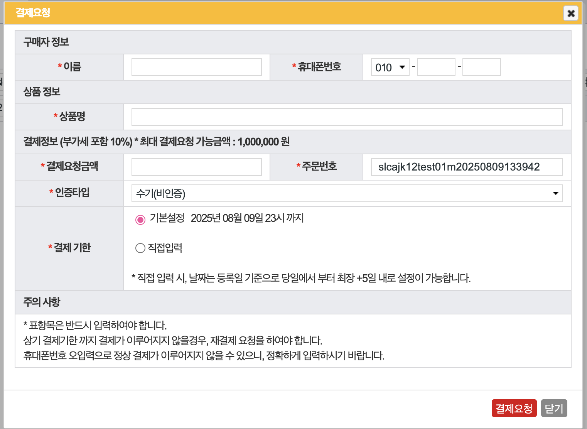
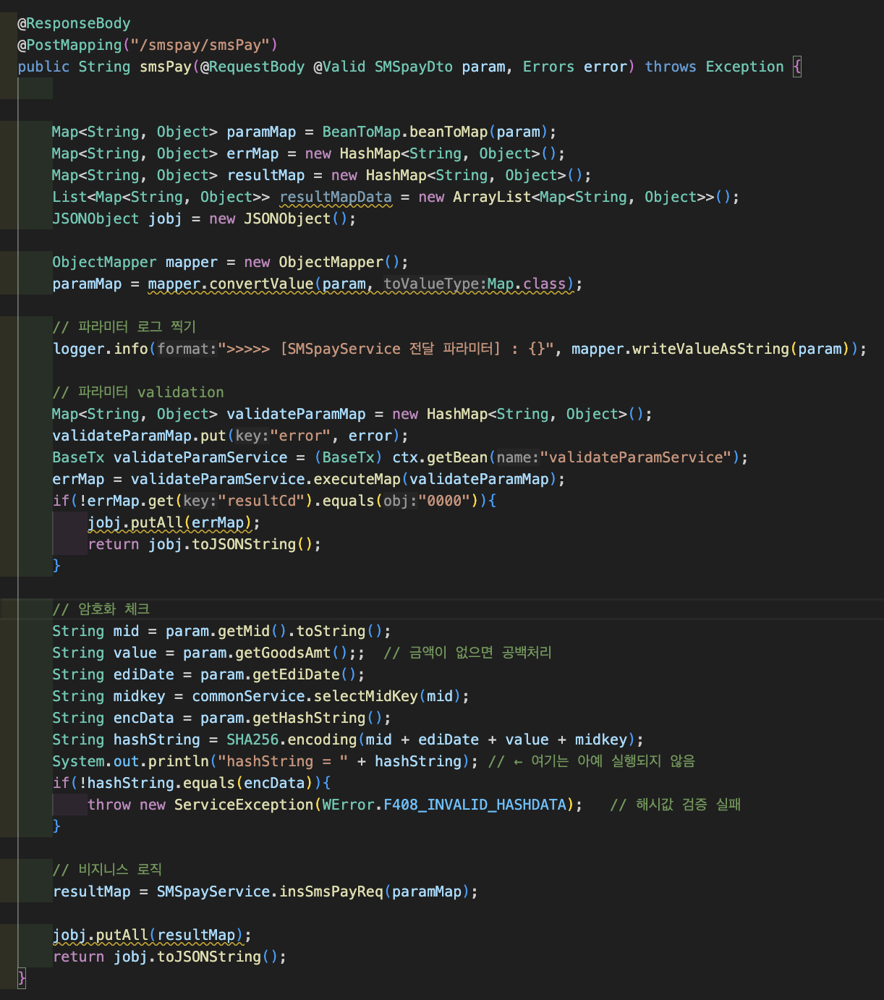
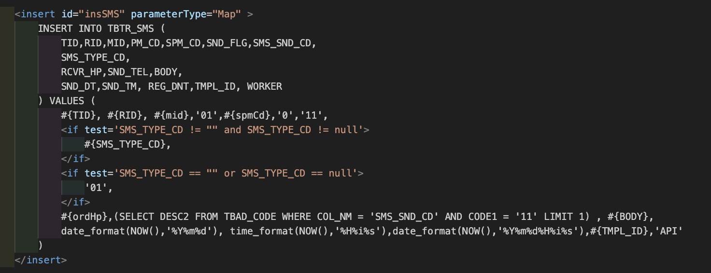
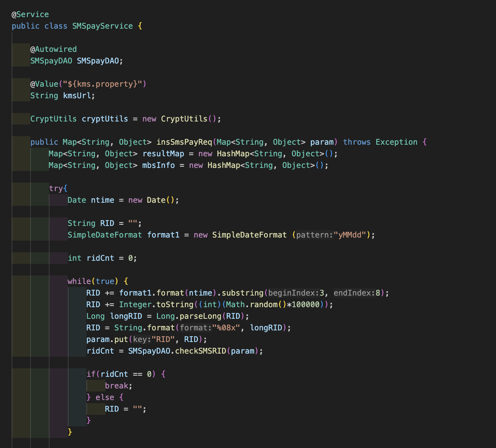

# SMS Payment Service

> SMS 인증 기반 결제 요청 및 승인 처리 시스템 (REST API 기반)

---

## 프로젝트 개요

| 항목 | 내용 |
|------|------|
| 개발 기간 | 2025.07 (약 1개월) |
| 개발 인원 | 1인 (단독 개발) |
| 역할 | API 설계, 비즈니스 로직 구현, DB 설계 및 데이터 처리 |
| 플랫폼 | Web (REST API) |

---

## 기술 스택

| 구분 | 기술 |
|------|------|
| Backend | Java 17, Spring Framework, MyBatis, REST API |
| Database | MariaDB |

---

## 주요 기능

- SMS 결제 요청 처리
- 인증 코드 검증
- 결제 승인 및 취소 처리
- 결제 상태 관리

---

## 핵심 구현

### 1. 결제 요청 및 SMS 발송 처리

<p align="center">
  
</p>
<p align="center">결제 요청 API</p>

- 이름, 휴대폰번호, 금액, 주문번호, 기한 등을 기반으로 REST API 호출하여 결제 요청 처리
- 서버는 요청 내역을 DB에 저장한 뒤 SMS 게이트웨이에 결제 링크 전송 위임
- 처리 흐름: UI 입력 → POST /sms/payment → DB 저장 → SMS 게이트웨이 전송

---

### 2. 요청 데이터 검증 및 보안 처리

<p align="center">
  
</p>
<p align="center">결제 요청 검증 로직</p>

- `@Valid` 기반 요청 데이터 검증 수행
- SHA-256 해시 검증을 통해 데이터 위변조 방지
- 필수값 및 형식 검증으로 잘못된 데이터의 DB 반영 사전 차단

---

### 3. SMS 발송 데이터 저장

<p align="center">
  
</p>
<p align="center">SMS 저장 SQL</p>

- MyBatis 기반 INSERT SQL 작성
- SMS 발송 요청 데이터를 `TBTR_SMS` 테이블에 저장
- 조건값에 따라 SMS 타입 분기 처리

---

### 4. 결제 요청 식별값(RID) 생성

<p align="center">
  
</p>
<p align="center">RID 생성 로직</p>

- 날짜 + 랜덤값 기반 고유 ID 생성
- DB 중복 체크를 통해 유일성 보장

---

### 5. 트랜잭션 및 안정성 처리

- 결제 처리 중 오류 발생 시 전체 작업 롤백 처리
- 데이터 정합성을 유지하기 위한 트랜잭션 적용
- 예외 처리 및 로그 기반 오류 추적

---

## 트러블슈팅

### 결제 처리 중 데이터 불일치 문제

**문제**
결제 처리 도중 오류 발생 시 일부 데이터만 반영되는 데이터 불일치 문제 발생

**해결**
트랜잭션 처리 적용으로 전체 작업 단위 관리, 상태값 기반 로직 도입으로 처리 흐름 제어

**결과**
데이터 정합성을 유지하면서 안정적인 결제 처리 흐름 확보

---

## 데이터 흐름

```
사용자 결제 요청
      ↓
SMS 인증 요청 및 코드 발송
      ↓
인증 완료 후 결제 승인 처리
      ↓
DB에 결제 상태 저장
```
